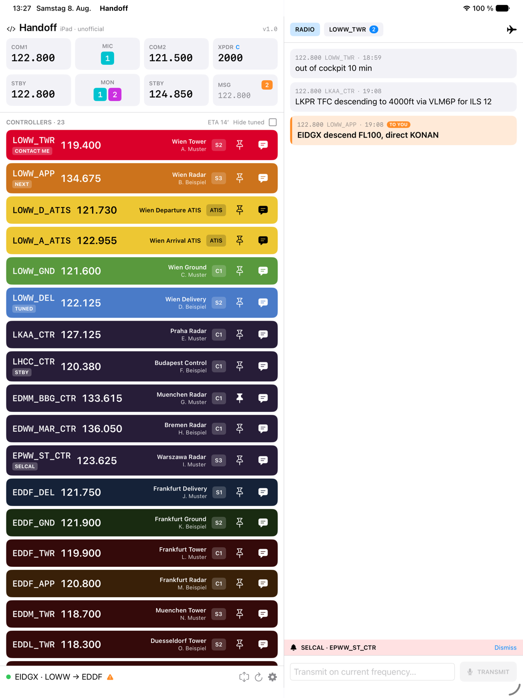
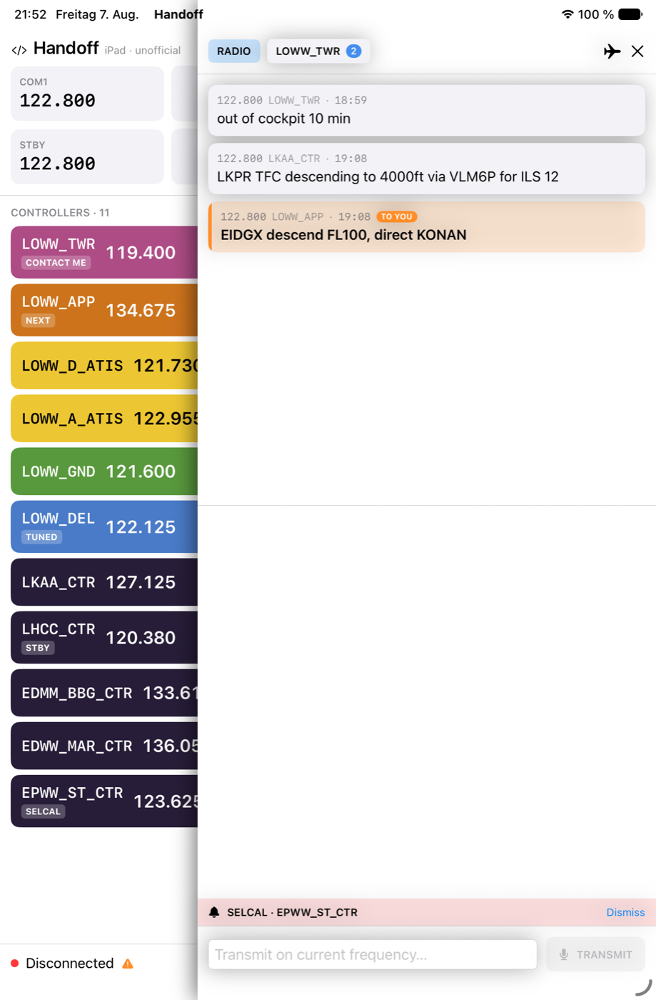

# Handoff for iPad

[](../../actions/workflows/tests.yml)

An **unofficial** iPad client for the [Handoff vPilot plugin](https://github.com/sushiat/vpilot-handoff)
by sushi.at — the VATSIM controller list, chat and radio panel on a second screen,
next to your charts in iPadOS Split View.

> This project is **not affiliated with, endorsed by, or maintained by sushi.at**.
> It is an independent client written against the plugin's public
> [`docs/protocol.md`](https://github.com/sushiat/vpilot-handoff/blob/master/docs/protocol.md),
> in the same spirit as that document's note that it is "the source of truth if
> you're building an alternate client (e.g. iOS)". Please report issues with this
> app here, not to the upstream project. The plugin itself, and the Android client
> this UI follows, are sushi.at's work.
>
> sushi.at was asked before this was published and gave their blessing for the
> name and for following the Android client's interface. Support for the iPad app
> is ours, not theirs — they have no iOS device to develop against.

## What it looks like

| Wide window — radio and chat beside the dashboard | Narrow split — chat folds into an overlay |
| --- | --- |
|  |  |

Sample data, not a live session.

## What it does

Everything runs over the plugin's LAN WebSocket — the Windows PC keeps doing the
talking to VATSIM, the iPad is a second screen for it.

- **Controller list**, ranked by the plugin, colour-coded per facility, with the
  station's rating, pin and chat shortcuts, and one-tap tuning to COM1/COM2/standby.
- **Radio panel** — COM1/COM2 active and standby, transmit/receive selection,
  transponder, all reflected live from SimConnect.
- **Chat** — private and radio messages, SELCAL alerts, and a nearby-traffic
  picker for starting a private chat.
- **Flight-plan cross-check** — flags a missing VATSIM flight plan, a SimBrief/VATSIM
  divergence, or a filed origin that doesn't match where the aircraft is sitting.
- **Colour themes** — the per-facility palette is editable, with colourblind-safe
  presets and named themes.
- **Adaptive layout** — the RADIO panel sits beside the dashboard on a wide window
  and folds into an overlay on a narrow split.

## Requirements

- iPad on iPadOS 17 or newer
- The [Handoff vPilot plugin](https://github.com/sushiat/vpilot-handoff) running on
  the PC with vPilot
- Both on the same LAN, with TCP 48765 (and UDP 48766 for auto-discovery) allowed
  through the Windows firewall

## Installing

There is no App Store build. Apple's store isn't a realistic route for a hobby
client that only talks to a program on your own PC, so the app is distributed the
same way the Android client is: as a plain build file you install yourself.

Each [release](../../releases) carries an **unsigned `.ipa`**. Unsigned is
deliberate — signing it here would tie it to one developer account and be useless
to everyone else. Sideloading tools re-sign it with *your* Apple ID instead.

### With SideStore or AltStore (free Apple ID)

1. Set up [SideStore](https://sidestore.io) or [AltStore](https://altstore.io)
   once, following their own instructions. Both want a computer for the initial
   pairing; SideStore then runs without one.
2. In the app's **Sources** tab, add this URL:

   ```
   https://raw.githubusercontent.com/MANFahrer-GF/vpilot-handoff-ios/main/docs/source.json
   ```

3. Install Handoff from the list.

Adding the source is worth the extra step: new versions then show up as an
update badge instead of you having to spot a release and move a file. If you'd
rather not, `Handoff-<version>.ipa` on the [releases page](../../releases)
installs directly.

What a **free** Apple ID costs you, and it's Apple's rule, not this app's:

- the app stops launching after **7 days** and has to be refreshed — both tools
  can do that automatically while the iPad is on your network,
- you can have at most **3** sideloaded apps at a time,
- the bundle identifier gets rewritten per install, so app data doesn't survive a
  switch between tools.

A paid Apple Developer account ($99/year) raises the 7 days to a year. It isn't
needed otherwise.

### Building it yourself instead

If you already have Xcode, building from source (below) and running it on your own
iPad is the simpler path and gives you the same 7-day free-account limit.

### What the app is allowed to do

It asks for **local network** access and nothing else. No account, no analytics,
no server of ours — the iPad talks only to your PC. The pairing token lives in the
iPad's Keychain, and the plugin's TLS certificate is pinned on first pairing, so a
different machine answering on that address is refused rather than trusted.

## Building

The Xcode project is generated from `project.yml`, so it isn't in version control.

```sh
brew install xcodegen
cp .env.example .env      # then put your Apple Development Team ID in it
source .env
xcodegen generate
open Handoff.xcodeproj
```

A free personal Apple ID is enough to install on your own iPad; Apple then expires
the build after 7 days and it has to be reinstalled.

### Tests

```sh
xcodebuild -project Handoff.xcodeproj -scheme Handoff \
  -destination 'platform=iOS Simulator,name=iPad Air 11-inch (M4)' test
```

### Looking at the UI without a plugin

Launching with `-handoffDemoData` fills the app with sample state. The flag is
`#if DEBUG`-only and has to be passed explicitly, so it never shows up in normal use.

### Cutting a release

Pushing a `v*` tag runs [`.github/workflows/release.yml`](.github/workflows/release.yml):
it archives with signing switched off, packages `Payload/Handoff.app` into an
`.ipa`, checks the version actually got stamped into the bundle, and opens a
**draft** release with the file attached. The draft is published by hand.

```sh
git tag v1.0.0 && git push origin v1.0.0
```

## Notes on the protocol

Two things in `docs/protocol.md` are easy to get wrong and worth repeating:

- **Decode defensively.** The plugin adds optional fields between versions and
  resends full state constantly. A model that throws on a missing field silently
  drops the whole message — that's how the chat panel here once ended up
  permanently empty.
- **The badge on a controller row is the VATSIM rating** (C1/S2/S3…), not a tuned
  indicator. `isCurrent`/`isStandbyTuned` are separate booleans.

## Credits

Data and upstream work this depends on:

- [Handoff vPilot plugin & Android client](https://github.com/sushiat/vpilot-handoff) — sushi.at (MIT)
- [VATSpy](https://github.com/vatsimnetwork/vatspy-data-project) — airport & FIR data (CC BY-SA 4.0)
- [VatGlasses](https://github.com/lennycolton/vatglasses-data) — sector boundaries (CC BY-NC-SA 4.0)
- [VATSIM Data Feed](https://vatsim.dev) — live network data
- [SimBrief](https://www.simbrief.com) by Navigraph — flight plan data
- [vPilot](https://vpilot.rosscarlson.dev) — the pilot client the plugin runs inside

## Author

iPad app by **Thomas Kant**, Gifhorn — built with **Claude (Anthropic)**.

The plugin this talks to, and the Android client whose interface this follows,
are sushi.at's work; see Credits above.

## License

MIT — see [LICENSE](LICENSE).
