# vPilot Remote

[](../../actions/workflows/tests.yml)
[](https://apps.apple.com/app/vpilot-remote/id6817687242)

An iPad client for the [Handoff vPilot plugin](https://github.com/sushiat/vpilot-handoff)
by sushi.at, published with their permission — the VATSIM controller list, chat
and radio panel on a second screen, next to your charts in iPadOS Split View.

> This is an **independent client, developed separately from sushi.at's plugin**.
> It is written against the plugin's public
> [`docs/protocol.md`](https://github.com/sushiat/vpilot-handoff/blob/master/docs/protocol.md),
> in the same spirit as that document's note that it is "the source of truth if
> you're building an alternate client (e.g. iOS)". Please report issues with this
> app here, not to the upstream project. The plugin itself, and the Android client
> this UI follows, are sushi.at's work.
>
> sushi.at was asked before this was published and explicitly permitted the
> name, the artwork and following the Android client's interface. Support for
> the iPad app is ours, not theirs — they have no iOS device to develop against.

## What it looks like

Click any shot for the full-size image, or read the
**[gallery](docs/gallery.md)** for what each state means.

<a href="docs/screenshots/dashboard-wide.png">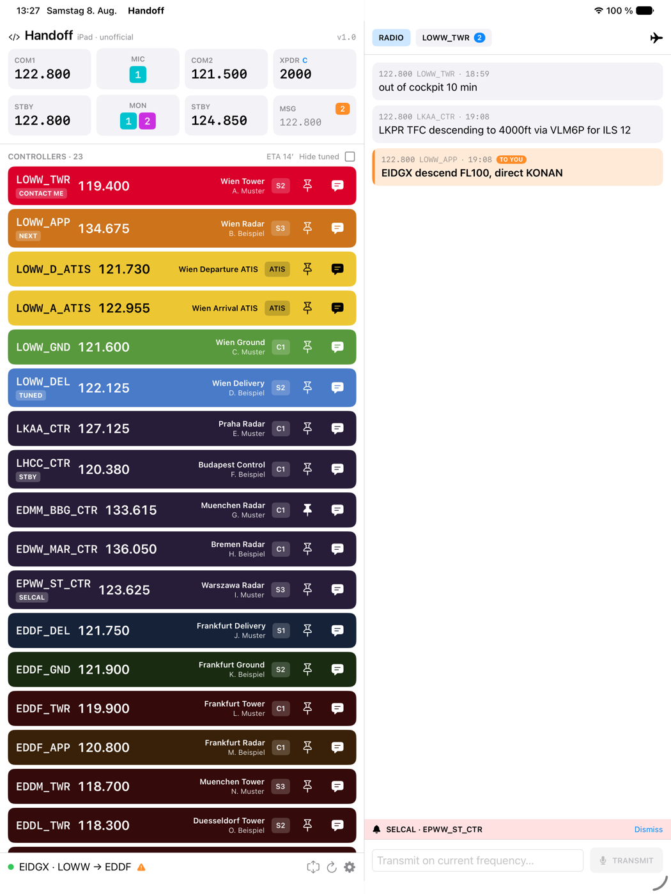</a>
<a href="docs/screenshots/dashboard-dark.png">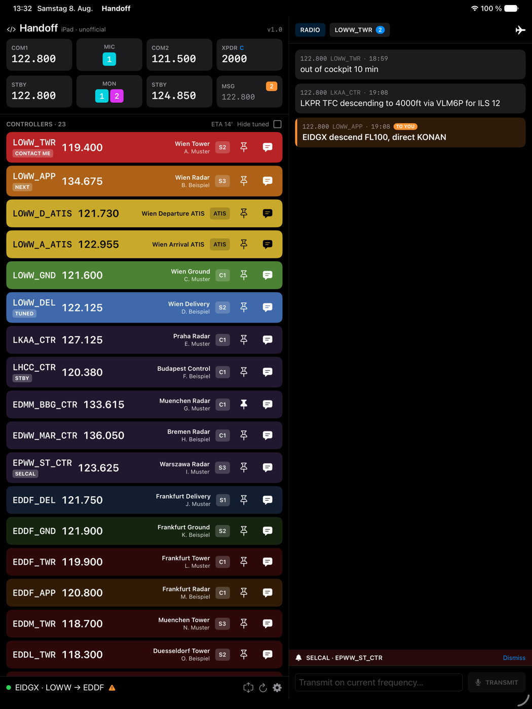</a>
<a href="docs/screenshots/narrow-chat.png">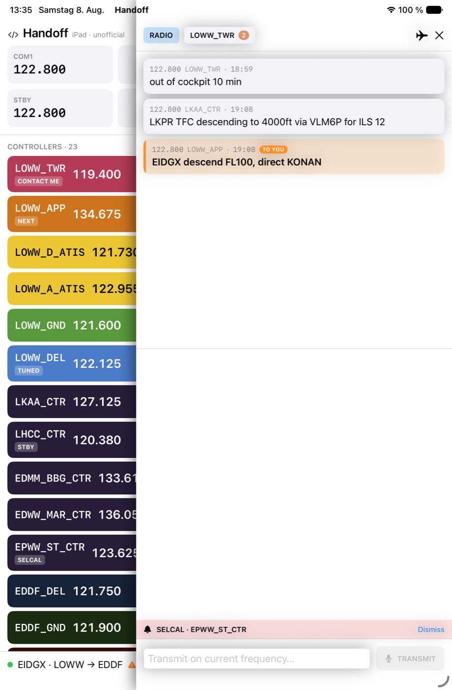</a>
<a href="docs/screenshots/status-expanded.png">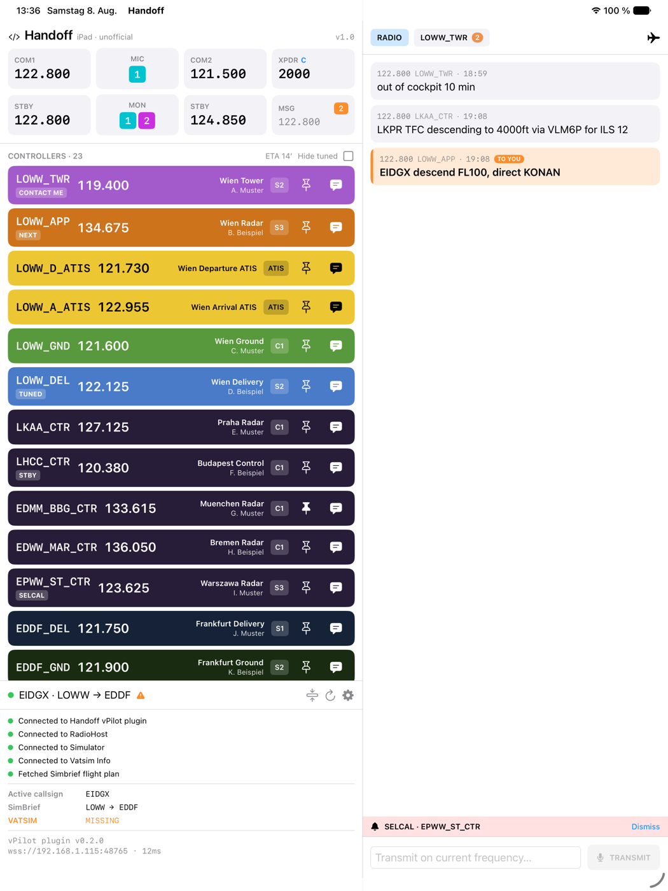</a>

<a href="docs/screenshots/controller-tune.png">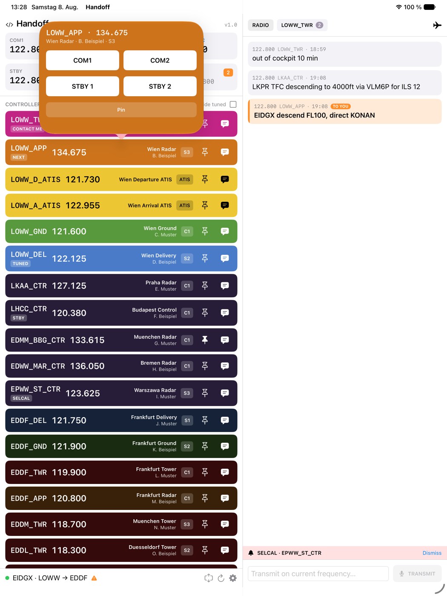</a>
<a href="docs/screenshots/frequency-tune.png">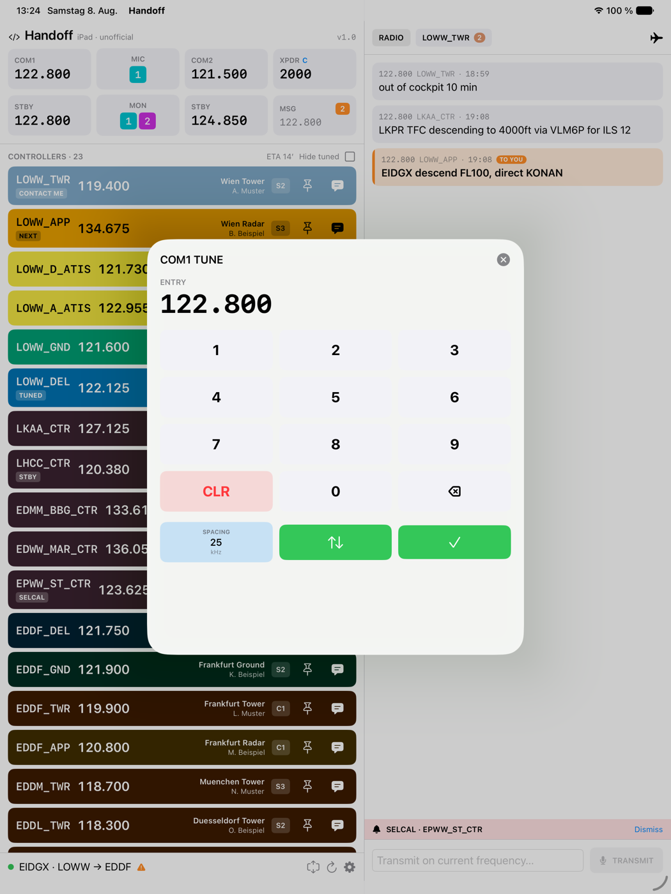</a>
<a href="docs/screenshots/transponder.png">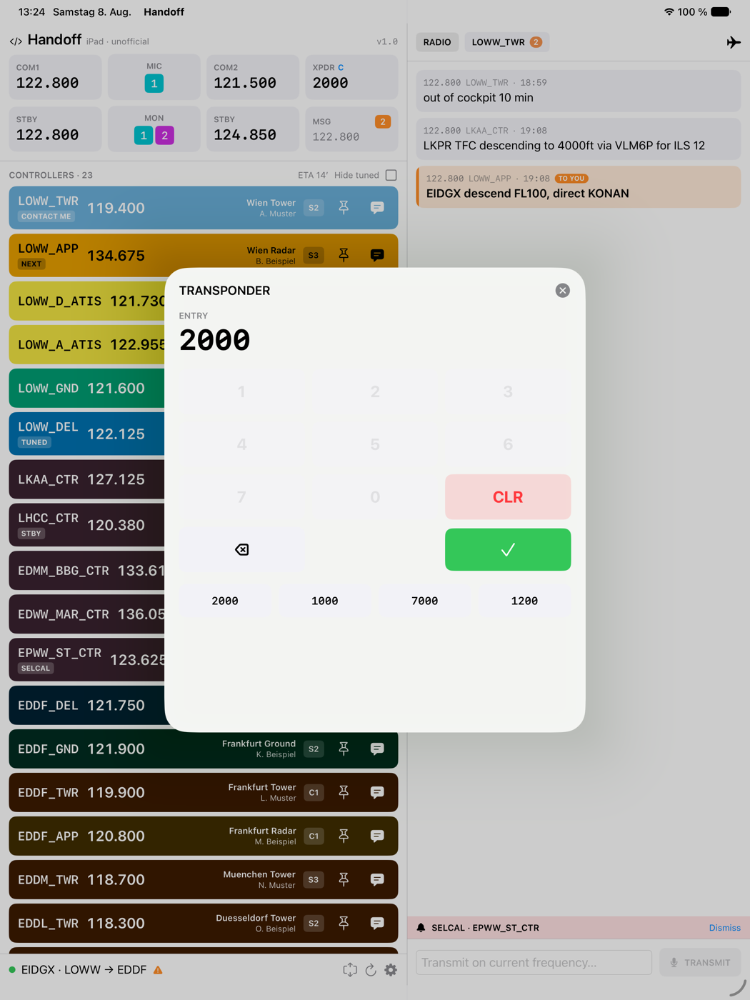</a>
<a href="docs/screenshots/private-chat.png">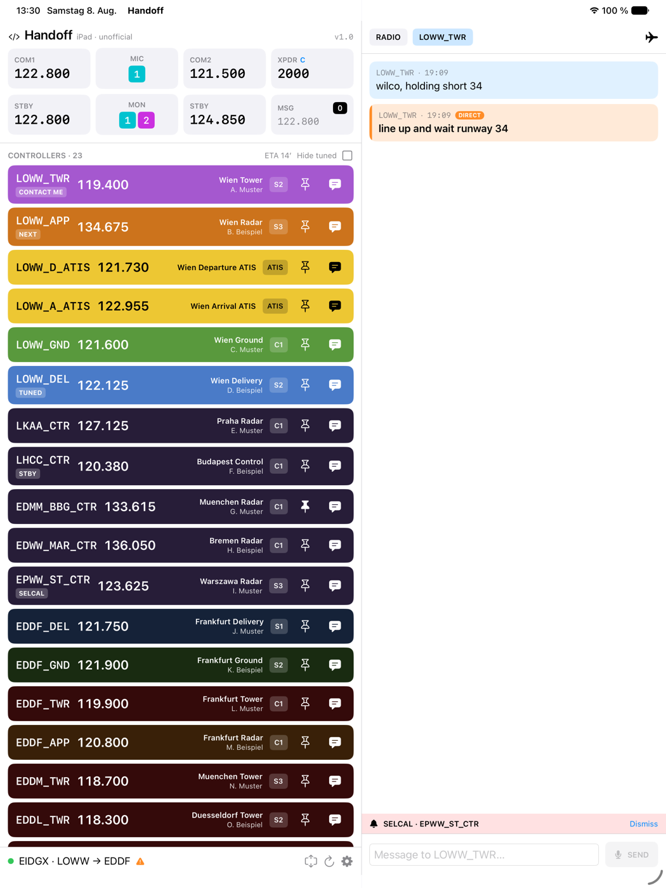</a>

<a href="docs/screenshots/nearby-aircraft.png">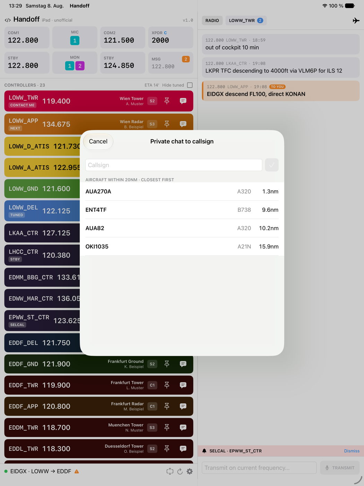</a>
<a href="docs/screenshots/settings.png">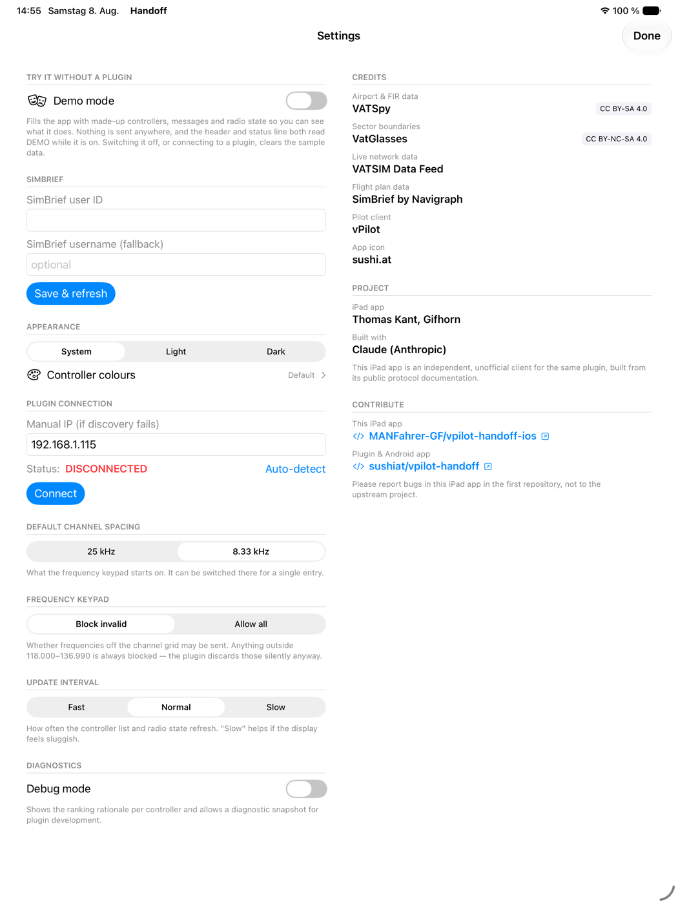</a>
<a href="docs/screenshots/theme-editor.png">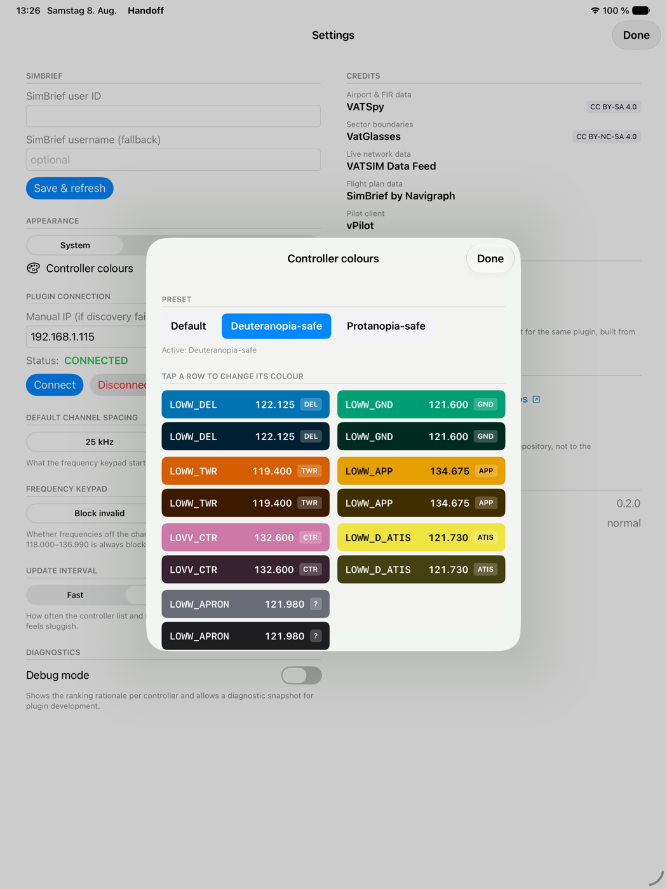</a>
<a href="docs/screenshots/identity.png">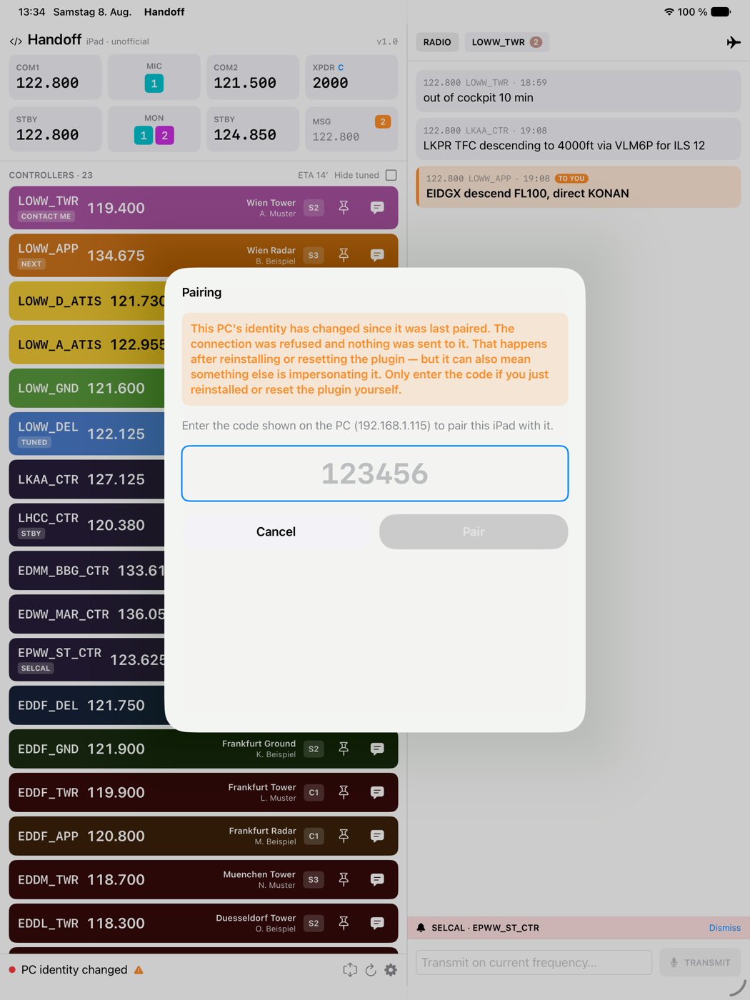</a>

Sample data, not a live session — the callsigns and messages are made up.

## What it does

Everything runs over the plugin's LAN WebSocket — the Windows PC keeps doing the
talking to VATSIM, the iPad is a second screen for it.

- **Controller list**, ranked by the plugin, colour-coded per facility, with the
  station's rating, pin and chat shortcuts, and one-tap tuning to COM1/COM2/standby.
- **Radio panel** — COM1/COM2 active and standby, transmit/receive selection,
  transponder, all reflected live from SimConnect.
- **Chat** — private and radio messages, SELCAL alerts, and a nearby-traffic
  picker for starting a private chat.
- **Flight-plan cross-check** — flags a missing VATSIM flight plan, a SimBrief/VATSIM
  divergence, or a filed origin that doesn't match where the aircraft is sitting.
- **Colour themes** — the per-facility palette is editable, with colourblind-safe
  presets and named themes.
- **Adaptive layout** — the RADIO panel sits beside the dashboard on a wide window
  and folds into an overlay on a narrow split.

## Requirements

- iPad on iPadOS 17 or newer
- The [Handoff vPilot plugin](https://github.com/sushiat/vpilot-handoff) running on
  the PC with vPilot
- Both on the same LAN, with TCP 48765 (and UDP 48766 for auto-discovery) allowed
  through the Windows firewall

## Installing

### From the App Store (recommended)

**[vPilot Remote on the App Store](https://apps.apple.com/app/vpilot-remote/id6817687242)** — free, updates arrive like any
other app, nothing to set up.

### With TestFlight (beta builds)

New versions go to TestFlight first. Install Apple's **TestFlight** app, then open
**https://testflight.apple.com/join/BNjesezx** on the iPad and tap *Accept*. A TestFlight build is good for 90 days;
the App Store version replaces it whenever you prefer the stable one.

### Building it yourself

If you have Xcode, building from source (below) and running it on your own iPad
works too; Apple's free-account rules apply (the build expires after 7 days).

Earlier versions were also distributed as an unsigned `.ipa` for SideStore and
AltStore. That stopped with the App Store release: the store build is signed,
updates itself and has no 7-day limit, so there is nothing the sideload route
still offers. The old releases stay downloadable for the record; the sideload
source now only carries a pointer to the App Store.

### What the app is allowed to do

It asks for **local network** access and nothing else. No account, no analytics,
no server of ours — the iPad talks only to your PC. The pairing token lives in the
iPad's Keychain, and the plugin's TLS certificate is pinned on first pairing, so a
different machine answering on that address is refused rather than trusted.

## Building

The Xcode project is generated from `project.yml`, so it isn't in version control.

```sh
brew install xcodegen
cp .env.example .env      # then put your Apple Development Team ID in it
source .env
xcodegen generate
open Handoff.xcodeproj
```

A free personal Apple ID is enough to install on your own iPad; Apple then expires
the build after 7 days and it has to be reinstalled.

### Tests

```sh
xcodebuild -project Handoff.xcodeproj -scheme Handoff \
  -destination 'platform=iOS Simulator,name=iPad Air 11-inch (M4)' test
```

### Looking at the UI without a plugin

**Settings → Demo mode** fills the app with sample controllers, messages and radio
state. It is a normal feature, not a debug flag: someone deciding whether to set a
plugin up should be able to see what they'd get first.

While it is on the header and the status line both read DEMO, and
`AppStore.send` refuses every outbound command — a tap changes the sample state and
nothing else. It is deliberately not persisted, so every launch starts in the real
mode rather than showing invented controllers to a pilot who forgot it was on.

`-handoffDemoData` still switches it on at launch for the screenshot tooling, and
`-handoffDemoScene connected|pairing|identity` (Debug builds only) parks the
connection somewhere a demo run can't otherwise reach.

### Running on a Mac

Apple Silicon Macs can run unmodified iPad apps directly — Apple calls this
"Designed for iPad", and it needed **no code changes here**: the setting that
enables it (`SUPPORTS_MAC_DESIGNED_FOR_IPHONE_IPAD`) is Xcode's default for an
iPad-only app that doesn't opt out, and this one doesn't.

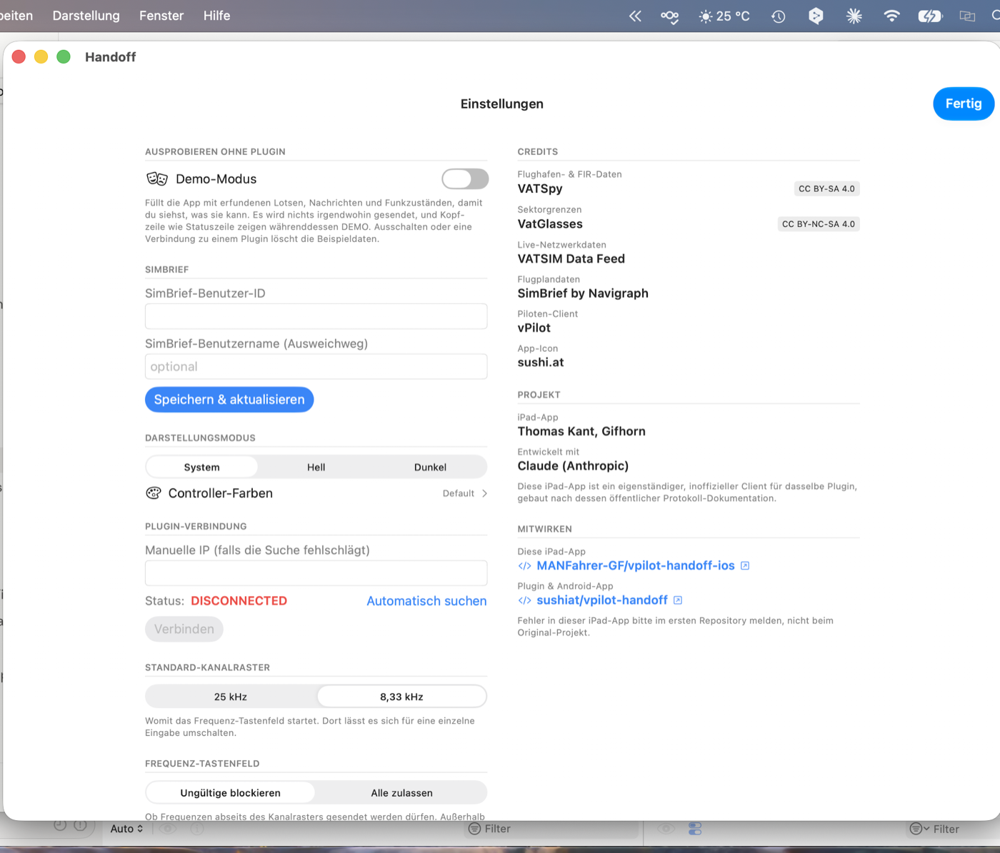

To try it: open the project as in *Building* above, then in Xcode's scheme
toolbar pick **My Mac (Designed for iPad)** instead of a simulator or device, and
run. It launches as an ordinary resizable window with a real Mac menu bar, and
every control works with a mouse and keyboard — verified interactively on
2026-08-08.

Two honest caveats:

- **No automated test coverage for this destination yet.** `xcodebuild test`
  against `platform=macOS,name=My Mac` currently crashes before the test bundle
  finishes bootstrapping, on this Xcode version — a tooling rough edge for this
  destination combination, not a defect in the app. The 111-test suite is
  exercised on iOS/iPadOS destinations, which is what CI runs.
- **Connectivity to a live plugin from this mode is untested.** Everything shown
  here is the UI running standalone; reaching an actual Handoff plugin over the
  network from a Mac-hosted instance hasn't been tried.

There is no separate downloadable macOS build, and handing someone else the
locally-built `.app` directly would not work: "Designed for iPad" execution
checks the Mac itself against the development provisioning profile's device list,
the same way it would check an iPhone or iPad. The first attempt to run this
target hit exactly that error --
`doesn't include the currently selected device` -- until Xcode registered this
Mac automatically. A personal profile only ever lists the machines its own Apple
ID has built on, so someone else's Mac is refused outright, not merely warned
about like an unsigned or ad-hoc-signed binary from Gatekeeper (no `xattr` or
right-click-Open workaround applies -- this isn't a trust prompt, it's a
provisioning check).

Distributing something that just opens for anyone needs a **Developer ID
certificate and notarization**, or a Mac App Store listing; neither is set up.
For now, running it on a Mac is a "build it yourself" capability: each person's
own Apple ID gets their own Mac added to their own profile automatically, the
same way running your own build on your own iPad works.

### Cutting a release

1. Bump `MARKETING_VERSION` and `CURRENT_PROJECT_VERSION` in `project.yml`, write
   the version's notes into `RELEASE-NOTES.md`, merge.
2. `xcodegen generate`, then in Xcode **Product → Archive → Distribute App → App
   Store Connect**. Submit the build in App Store Connect; TestFlight gets it
   first.
3. Once it is live, tag it. Pushing a `v*` tag runs
   [`.github/workflows/release.yml`](.github/workflows/release.yml), which opens a
   **draft** GitHub release with `RELEASE-NOTES.md` as its body — no binary, the
   App Store is the download. Publish the draft by hand.

```sh
git tag v1.2.2 && git push origin v1.2.2
```

## Notes on the protocol

Two things in `docs/protocol.md` are easy to get wrong and worth repeating:

- **Decode defensively.** The plugin adds optional fields between versions and
  resends full state constantly. A model that throws on a missing field silently
  drops the whole message — that's how the chat panel here once ended up
  permanently empty.
- **The badge on a controller row is the VATSIM rating** (C1/S2/S3…), not a tuned
  indicator. `isCurrent`/`isStandbyTuned` are separate booleans.

## Credits

Data and upstream work this depends on:

- [Handoff vPilot plugin & Android client](https://github.com/sushiat/vpilot-handoff) — sushi.at (MIT)
- **App icon** — the handoff mark is sushi.at's artwork, reused with their permission
  and traced from `plugin/Assets/handoff.svg` upstream rather than redrawn. The iPad
  version drops the baked-in corner radius and the alpha channel, because iOS masks
  icons itself and requires them opaque; see [`tools/make-icon.py`](tools/make-icon.py).
- [VATSpy](https://github.com/vatsimnetwork/vatspy-data-project) — airport & FIR data (CC BY-SA 4.0)
- [VatGlasses](https://github.com/lennycolton/vatglasses-data) — sector boundaries (CC BY-NC-SA 4.0)
- [VATSIM Data Feed](https://vatsim.dev) — live network data
- [SimBrief](https://www.simbrief.com) by Navigraph — flight plan data
- [vPilot](https://vpilot.rosscarlson.dev) — the pilot client the plugin runs inside

## Author

iPad app by **Thomas Kant**, Gifhorn — built with **Claude (Anthropic)**.

The plugin this talks to, and the Android client whose interface this follows,
are sushi.at's work; see Credits above.

## Support and privacy

- **[Support](https://manfahrer-gf.github.io/vpilot-handoff-ios/support)** — where
  to ask, and the usual suspects to rule out first. iPad problems belong in
  [this tracker](../../issues), not upstream.
- **[Privacy](https://manfahrer-gf.github.io/vpilot-handoff-ios/privacy)** — no
  server, no account, no analytics, no tracking. What is kept on the iPad, and the
  one case where a screenshot leaves the app.

## License

MIT — see [LICENSE](LICENSE).
