# Gallery

Every shot is the app running on an iPad simulator against **sample data**, not a
live session — the callsigns, controllers and messages are made up. The layout,
colours and dialogs are real.

## The dashboard

Radio tiles across the top, the ranked controller list below, chat beside it, and
a permanent status line at the bottom. Nothing is hidden behind a tab.

Rows are coloured by facility — Delivery, Ground, Tower, Approach, Centre, ATIS.
Stations relevant to your flight keep the full colour; the rest are dimmed toward
black so the list can be long without being loud. `CONTACT ME` pulses between the
facility colour and the alert colour, `NEXT` marks the station the plugin expects
you to be handed to, `TUNED` and `STBY` mark what your radios are actually on, and
`SELCAL` marks a station that has called you. The badge on the right is the
controller's **VATSIM rating** (S1–C1, SUP, ADM), not a tuning indicator.

### Dark

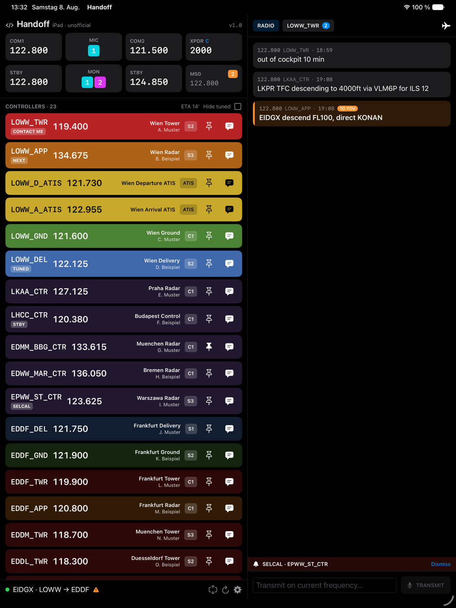

Light, dark and "follow the system" are separate from the colour theme, and the
theme carries its own extra darkening for dark mode so facility colours don't glow
in a night cockpit.

### Narrow window and Split View

On a narrow split the chat folds into an overlay behind the MSG tile, so the app
still works beside your charts.

| Controller list only | Chat pulled over it |
| --- | --- |
| 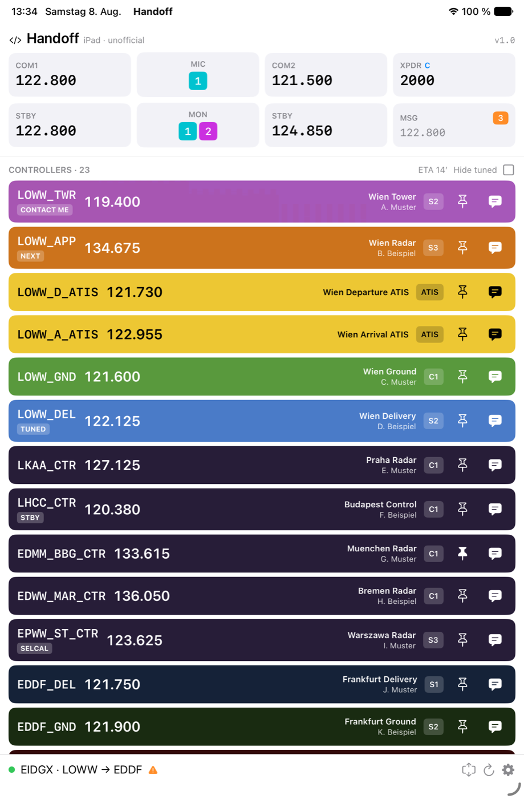 | 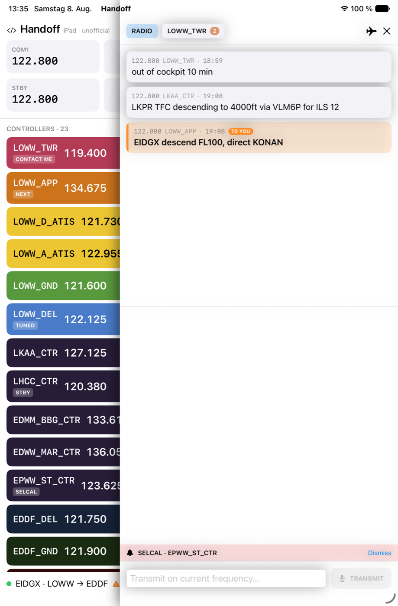 |

## Status line

Collapsed it is one line: connection dot, active callsign, route, and a warning
triangle if the flight-plan cross-check found something. Expanded it explains
itself.

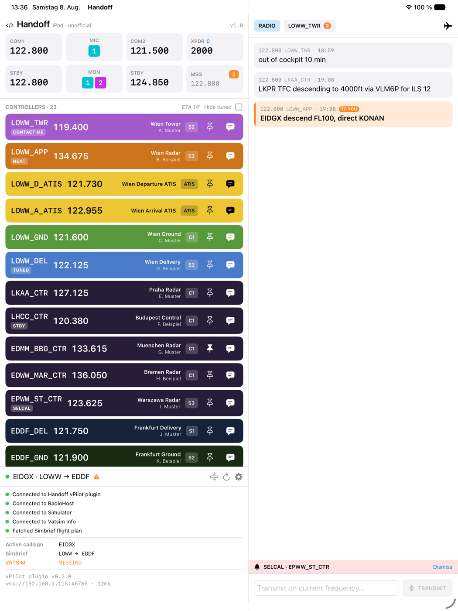

Here the triangle is the cross-check: SimBrief has LOWW → EDDF but **no VATSIM
flight plan is filed**. It also flags a SimBrief/VATSIM divergence and a filed
origin that doesn't match where the aircraft is parked. The bottom line carries the
plugin version, the endpoint it is talking to, and the last round-trip time.

## Chat

Radio traffic and private conversations are separate tabs with their own unread
counts. Anything naming your own callsign is highlighted rather than left to scroll
past — `TO YOU` on the frequency, `DIRECT` in a private conversation.

| Radio, with a call that names you | A private conversation |
| --- | --- |
|  | 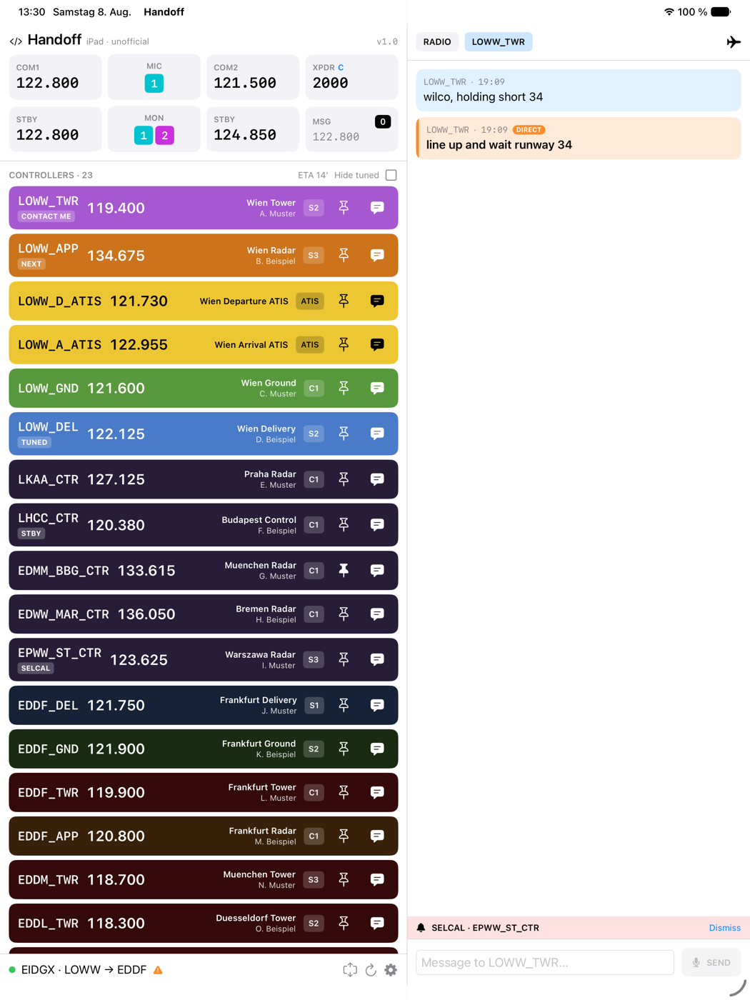 |

The aircraft button at the top right of the chat panel starts a private chat with
traffic around you, closest first, without typing a callsign.

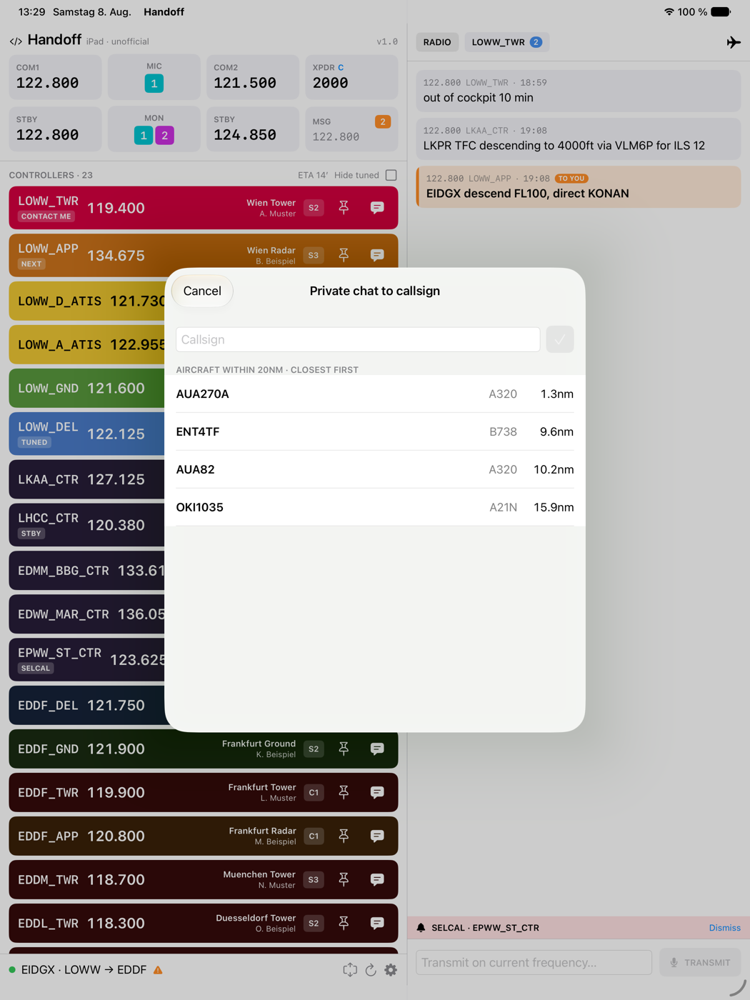

## Tuning

Tap a controller row for the stations your radios can take it on, or the pin.

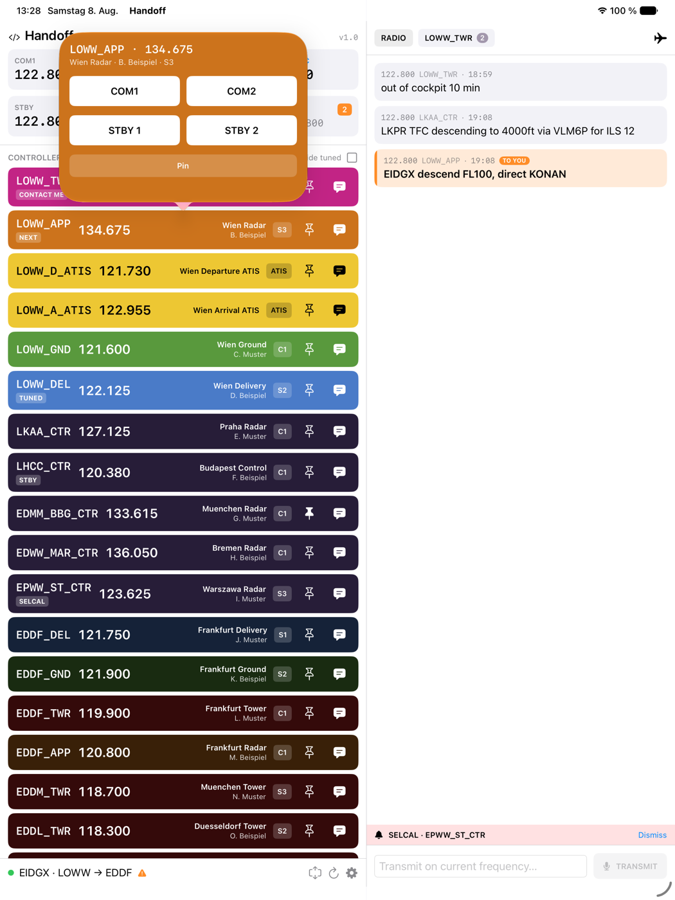

Tap a radio tile for the keypad. Channel spacing can be switched per entry, and
frequencies off the channel grid can be blocked — the plugin discards those
silently, so it is better to refuse them here.

| Frequency | Transponder |
| --- | --- |
| 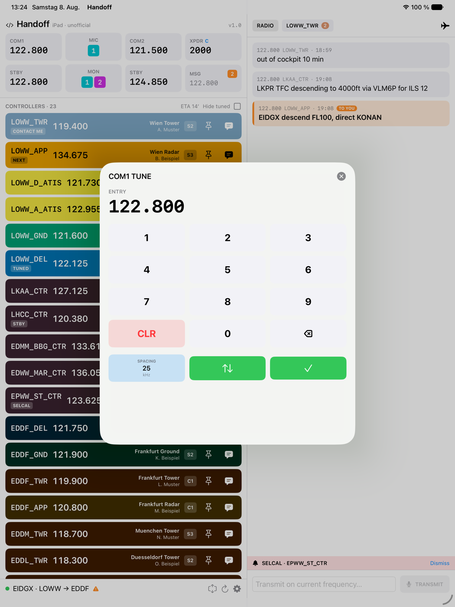 | 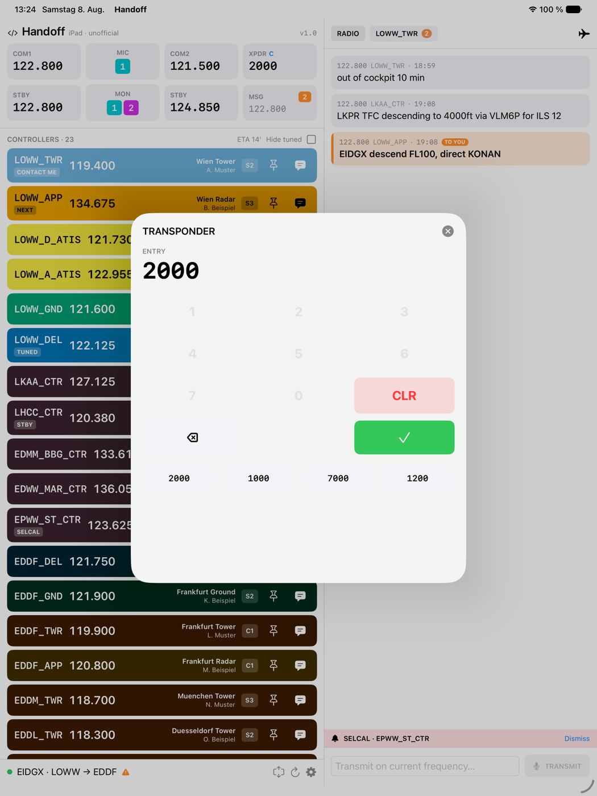 |

The transponder pad has no 8 and 9 on purpose: squawk codes are octal.

## Settings

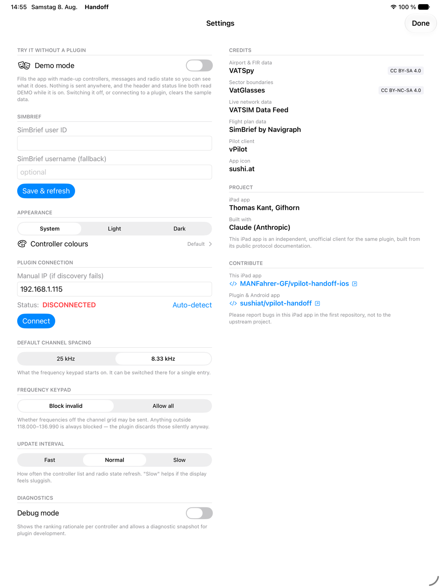

**Demo mode** sits at the top because this screen opens by itself on a first launch
with no plugin configured — which is exactly when someone has nothing to look at.
It fills the app with the sample data every shot on this page uses. While it is on,
the header and the status line both read DEMO, and no command leaves the device:
tapping a frequency changes the sample state and nothing else. Switching it off, or
connecting to a plugin, clears the sample data.

The cockpit is English everywhere. Only these settings screens follow the iPad's
language, in English or German. The right column credits the upstream work and the
data sources, and says where bugs in this app belong.

## Colour themes

Every facility colour is editable, in both its full and dimmed variant, with
colourblind-safe presets derived from the Okabe-Ito palette.

| Per-facility colours | Brightness and contrast |
| --- | --- |
| 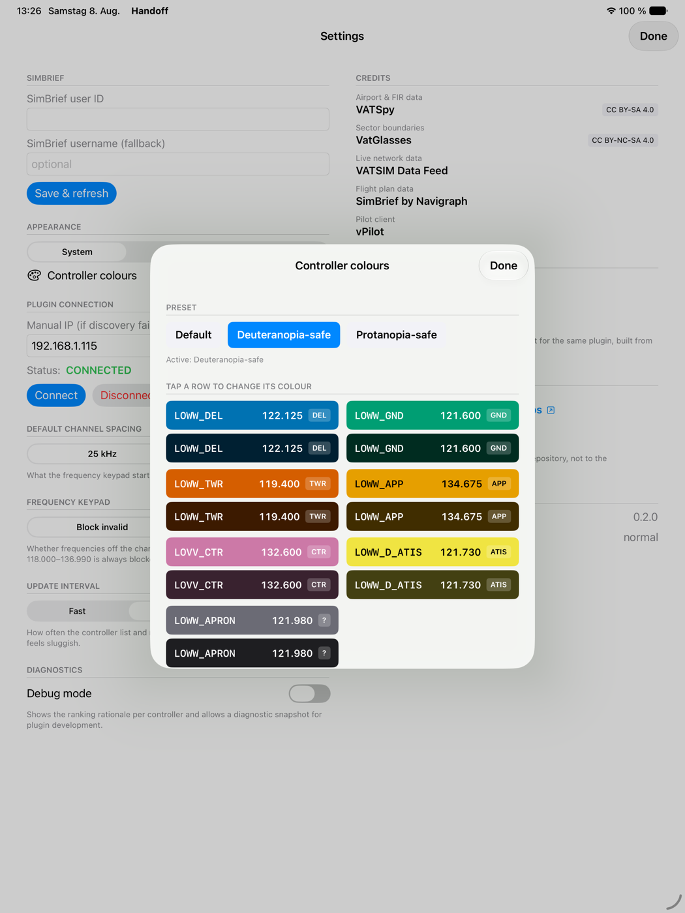 | 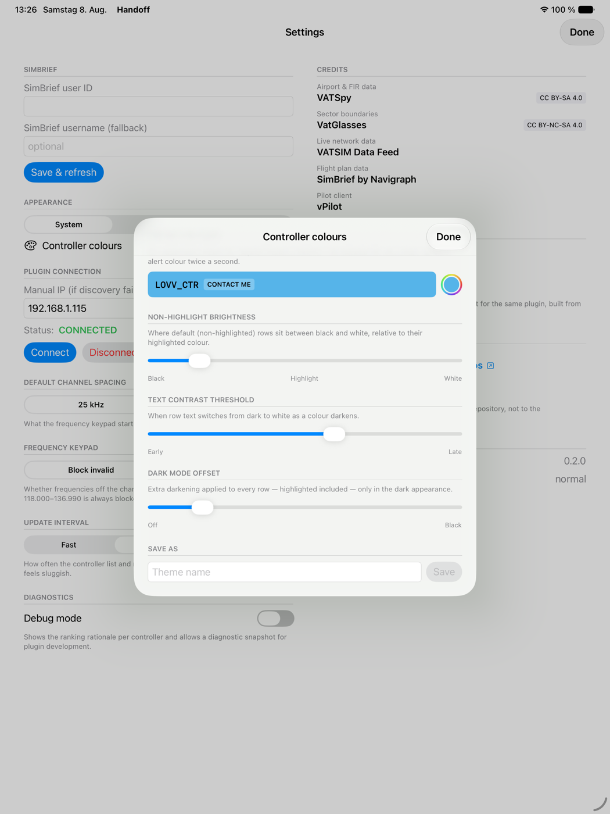 |

The text contrast threshold decides when row text flips from dark to white as a
colour darkens, so a hand-picked colour can't end up with unreadable text.

## Pairing and identity

First connection asks for the code the plugin shows on the PC. The plugin's TLS
certificate is pinned at that moment.

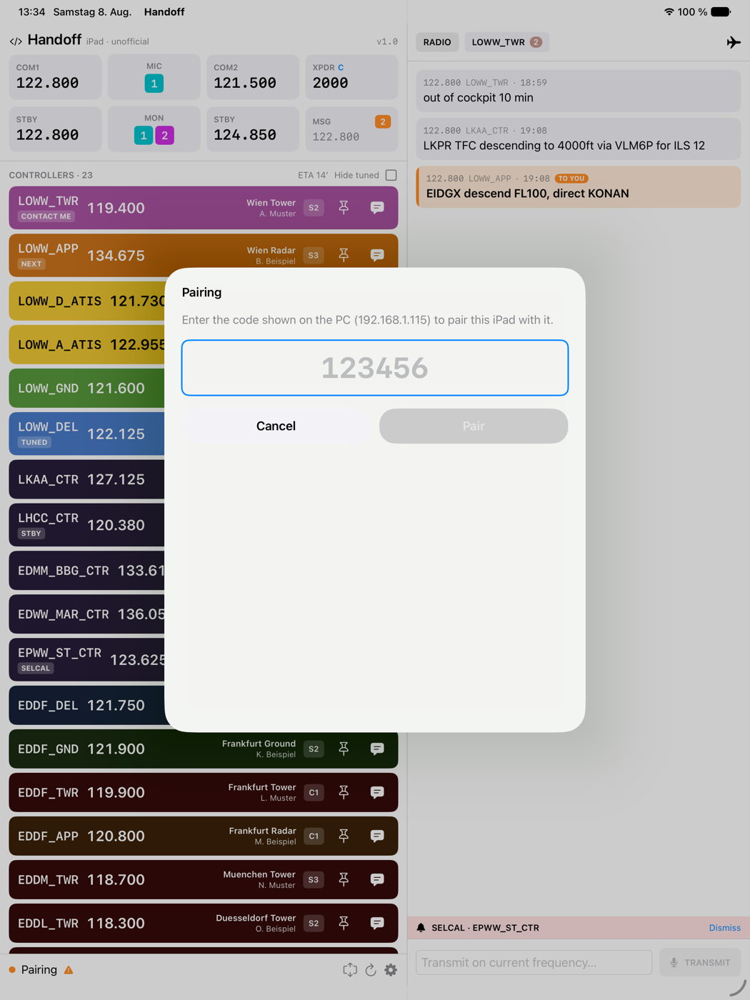

If the certificate later changes, the connection is **refused before anything is
sent** and the app says why rather than quietly reconnecting. That happens after a
plugin reinstall — and it is also what impersonation would look like, which is why
it is a decision and not a notification.

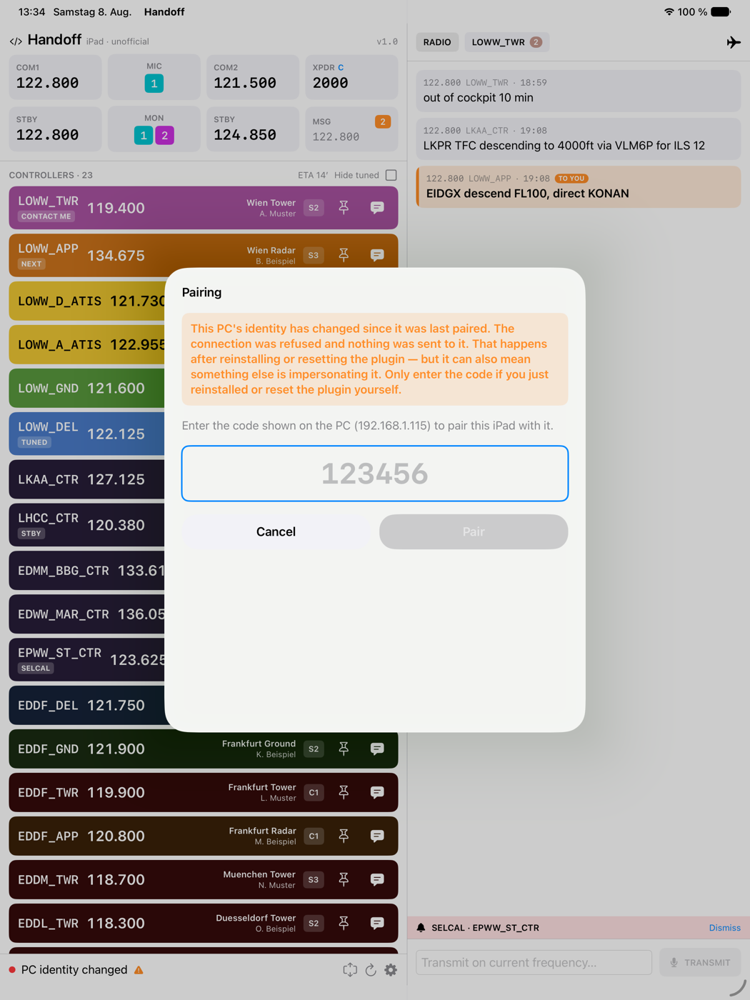
